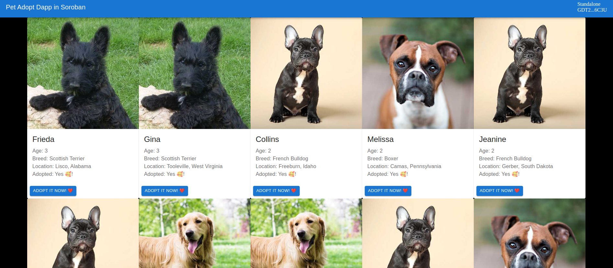

# Chapter 1: Introduction and Setup



Welcome to the Pet Adopt Soroban Dapp!
We will build together a fun app to adopt cute pets using the Soroban Blockchain, the Freighet wallet and the *@soroban-react* library

The final (main branch) version of this project is hosted in Vercel: 

## 1.1 Setup
- node
- soroban-cli v0.3.3
- docker


First clone the simple version of this dapp, where no soroban interaction has been introduced yet: 
```
git clone --branch simple-site https://github.com/esteblock/pet-adopt-soroban

```

```
cd pet-adopt-soroban
yarn
yarn dev
```

## 1.2 Install Frighter:

Configure Freighter

1. Install the custom Freighter Soroban release from https://github.com/stellar/freighter/releases/tag/v2.6.0-beta.2

2. Enable "Experimental Mode" in the settings (gear icon).

3. Add a custom network:

|   |   |
|---|---|
| Name | Standalone |
| URL | http://localhost:8000/soroban/rpc |
| Passphrase | Standalone Network ; February 2017 |
| Allow HTTP connection | Enabled |
| Switch to this network | Enabled |

4. Add some Standalone network lumens to your Freighter wallet.

  a. Copy the address for your freighter wallet.
  b. Visit `http://localhost:8000/friendbot?addr=<your address>`
